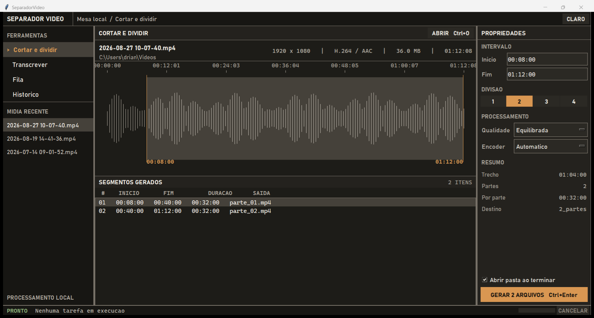
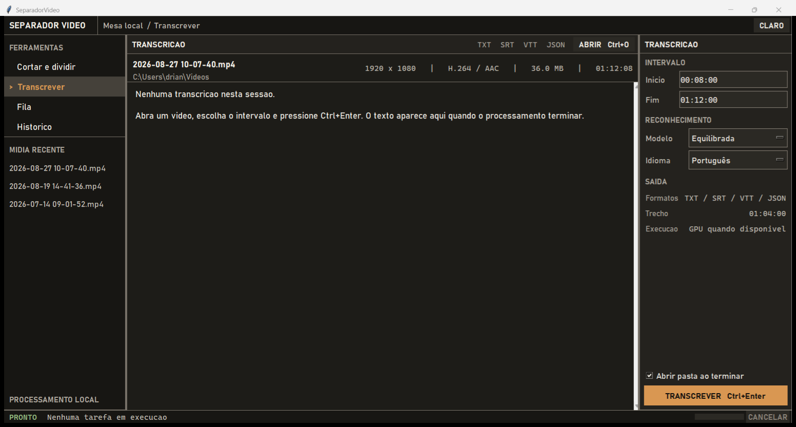

# Separador e Transcritor de Video

Ferramenta local para Windows: recorta, divide, comprime e transcreve videos. FFmpeg + Faster-Whisper, CUDA quando disponivel e CPU como fallback.





## Comece aqui

| Objetivo | Caminho |
| --- | --- |
| Usar o programa | Leia [Como abrir](#como-abrir) e [Como usar](#como-usar). |
| Entender o codigo | Consulte [Arquitetura](docs/ARQUITETURA.md). |
| Auditar ou validar | Siga o [Guia de auditoria](docs/AUDITORIA.md). |
| Gerar o executavel | Consulte [Build e distribuicao](docs/BUILD_E_DISTRIBUICAO.md). |
| Contribuir | Leia [CONTRIBUTING.md](CONTRIBUTING.md). |

## O que ele faz

- Divide videos em 2, 3 ou 4 partes.
- Recorta um intervalo exato do video.
- Permite escolher inicio e fim no formato `HH:MM:SS`.
- Comprime os videos usando FFmpeg.
- Usa aceleração NVIDIA NVENC quando disponível.
- Transcreve audio/video em português.
- Gera arquivos `.txt`, `.srt`, `.vtt` e `.json`.
- Mostra tarefas, progresso cancelavel e resultados recentes.
- Preserva tema, secao ativa, filtros e largura dos paineis.
- Organiza tudo dentro da pasta `saidas/`.

Na amostra local de 120 segundos em portugues, o perfil equilibrado caiu de aproximadamente 55 s no backend anterior para 6,6 s com Faster-Whisper Turbo em uma RTX 3050 Laptop de 4 GB. Medicao e limites: [docs/INFERENCIA.md](docs/INFERENCIA.md).

## Requisitos

- Windows 10 ou 11.
- Python 3.11 ou superior.
- FFmpeg instalado.
- Internet na primeira transcricao, para baixar o modelo Whisper.

## Estrutura do repositorio

```text
app/                    nucleos, shell e interface grafica
assets/                 icone e imagens da interface
docs/                   arquitetura, auditoria e decisoes tecnicas
tests/                  testes automatizados pequenos
SeparadorVideo.pyw      entrada principal sem terminal
separar_video.py        CLI de corte, divisao e compressao
transcrever_video.py    CLI de transcricao
INSTALAR_WINDOWS.ps1    instalacao das dependencias
CRIAR_EXECUTAVEL.ps1    build e ZIP para Windows
```

Arquivos grandes e privados, como videos, transcricoes, modelos e builds, ficam fora do Git. Veja a lista e os motivos no [guia de auditoria](docs/AUDITORIA.md).

## Instalacao

Baixe o projeto pelo GitHub e extraia a pasta.

Abra o PowerShell dentro da pasta do projeto e rode:

```powershell
powershell -ExecutionPolicy Bypass -File .\INSTALAR_WINDOWS.ps1
```

Se o FFmpeg ainda nao estiver instalado, rode:

```powershell
winget install Gyan.FFmpeg
```

Feche e abra o PowerShell depois da instalacao do FFmpeg.

## Como abrir

### Executavel pronto

Extraia todo o arquivo `SeparadorVideo_Windows.zip` e abra:

```text
SeparadorVideo.exe
```

O pacote ja inclui FFmpeg e nao precisa de Python. Nao mova somente o `.exe`: mantenha a pasta `_internal` ao lado dele.

### Pelo codigo-fonte

Clique duas vezes em:

```text
SeparadorVideo.pyw
```

Ele abre como aplicativo normal, sem terminal.

Se nao abrir, veja o arquivo:

```text
SeparadorVideo_erro.log
```

## Como usar

1. Clique em `ABRIR` ou pressione `Ctrl+O`.
2. Selecione o arquivo `.mp4`, `.mov`, `.mkv`, `.avi`, `.m4v` ou `.webm`.
3. Informe `Inicio` e `Fim` no painel direito.
4. Em `Cortar e dividir`, escolha de 1 a 4 partes e pressione `Ctrl+Enter`.
5. Em `Transcrever`, escolha modelo e idioma e pressione `Ctrl+Enter`.
6. Acompanhe ou cancele a operacao na barra inferior e consulte os arquivos em `Historico`.

Atalhos principais:

| Atalho | Acao |
| --- | --- |
| `Ctrl+O` | Abrir video. |
| `Ctrl+Enter` | Executar a acao da secao atual. |
| `Ctrl+1` a `Ctrl+4` | Alternar entre as quatro secoes. |
| `Ctrl+K` | Abrir a barra de comandos. |
| `Ctrl+Shift+L` | Alternar tema claro/escuro. |

As saidas ficam organizadas assim:

```text
saidas/
  nome-do-video/
    3_partes/
      nome-do-video_parte_01_de_03.mp4
      nome-do-video_parte_02_de_03.mp4
      nome-do-video_parte_03_de_03.mp4
    transcricao/
      nome-do-video_transcricao.txt
      nome-do-video_transcricao.srt
      nome-do-video_transcricao.vtt
      nome-do-video_transcricao.json
```

## Perfis de transcricao

- `Rapida`: usa modelo menor. Boa para testes.
- `Equilibrada`: usa Whisper Turbo multilingue na GPU. E a opcao recomendada para portugues.
- `Maxima qualidade`: melhor resultado, mas demora mais.

Na primeira vez, o modelo pode demorar para baixar.
Se uma transcricao for cancelada, execute-a novamente com as mesmas opcoes: o app retoma do ultimo ponto salvo.

Em placas NVIDIA com 4 GB de memoria, o perfil equilibrado usa quantizacao `int8_float16` para ganhar velocidade e evitar falta de memoria. Se a GPU nao estiver disponivel, o app continua automaticamente pela CPU.

## Linha de comando

Recortar do minuto 8 ate 1 hora e 12 minutos:

```powershell
python separar_video.py -i "C:\caminho\video.mp4" -p 1 --inicio 480 --fim 4320
```

Dividir em 3 partes:

```powershell
python separar_video.py -i "C:\caminho\video.mp4" -p 3 --qualidade equilibrada
```

Transcrever:

```powershell
python transcrever_video.py -i "C:\caminho\video.mp4" --perfil equilibrada --idioma pt
```

Transcrever somente um intervalo:

```powershell
python transcrever_video.py -i "C:\caminho\video.mp4" --perfil equilibrada --idioma pt --inicio 480 --fim 4320
```

## Gerar o executavel

```powershell
powershell -ExecutionPolicy Bypass -File .\CRIAR_EXECUTAVEL.ps1
```

O executavel fica em `executaveis/SeparadorVideo/` e o ZIP para distribuicao em `executaveis/SeparadorVideo_Windows.zip`.

As instrucoes de validacao e publicacao estao em [Build e distribuicao](docs/BUILD_E_DISTRIBUICAO.md).

## Desenvolvimento e auditoria

Verificacao rapida:

```powershell
python -m unittest discover -s tests -v
python app\video_splitter_gui.py --self-test
git diff --check
```

Documentacao tecnica completa: [docs/README.md](docs/README.md).

## Observacoes

- Videos, transcricoes, modelos baixados e executaveis gerados nao ficam no GitHub.
- O FFmpeg precisa estar instalado no Windows ou colocado em `ferramentas/ffmpeg/bin/`.
- O desempenho depende do tamanho do video, do processador e da placa de video.
- O app procura automaticamente CUDA instalado pelo PyTorch ou CUDA Toolkit. Sem essas DLLs, continua pela CPU.

## Licenca

[MIT](LICENSE).
